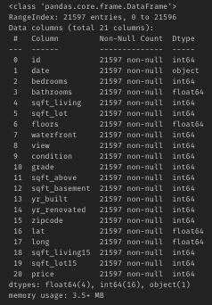
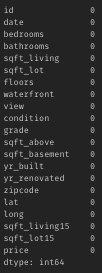

# Regression_Mid-Project

# 1 The objective of the project
The main objective of this project is to build a model that will predict the price of a house based on features provided in the dataset. 
The senior management also wants to explore the characteristics of the houses using some business intelligence tool.
Moreover, the first mission for this project is to check if some variables are explained by the target column 'Price' which is the market value of the houses. The second purpose is to see if the linear regression model fits to this data with the target.

# 2 The organization of the project 
For this project, we will see the use of different tools for answering questions and creating a linear regression model. The steps are :

    1) Answering to some questions on the SQL workbench
    2) Cleaning, analysing, creating the linear regression model and fitting it to the dataset
    3) Answering some question on the business intelligence tool which is Tableau
    
# 3 SQL questions and queries
Before we move to the main objective of this project, a few SQL questions were answered where different tools where used such as dropping a column, order by, grouping by, count, avg (average), where, having with subqueries, standard deviation for calculating the correlation and rank statement. 
The queries for these questions can be find in the file named "SQL questions and queries".

# 4 Imported libraries
In order to analyse and built my model, I imported the needed libraries such as :

    - pandas
    - numpy
    - matplotlib
    - scipy.stats
    - sklearn.metrics (mean_squared_error, r2_score, mean_absolute_error)
    - sklearn.linear_model (LinearRegression)
    - sklearn.preprocessing (OneHotEncoding, Normalizer)
    - statsmodels.api
    - seaborn

# 5 Explanation of how the data was processed (including the cleaning and selection of the variables to include in the model)
After importing the libraries, I imported the dataset and checked a few information about it such as :

    - the dataset shape : 
        - 21597 rows
        - 21 columns

    - the type of the columns : numerical or categorical. 

    
We can see that there is only 1 categorical column and the rest is numerical. Moreover, a few columns can be convert to categorical because there are only a few unique values in each column. These columns, with respectively the different variables, are : 

        - 'bedrooms' : from 1 to 10 and 33
        - 'bathrooms' : from 0.5 until 5.25 by step of 0.25
        - 'floors' : from 1 to 3.5 by step of 0.5
        - 'waterfront' : 0 (no waterfront) and 1 (with waterfront)
        - 'view' : from 0 to 5
        - 'grade' : from 3 to 12
        
    - checking the difference between the 75% and the max row to see in which columns there is a huge gap and which one to clean the outliers. We can see here that there is a big difference in the columns : 'sqft_living','sqft_lot', 'sqft_living15','sqft_lot15','sqft_basement' and 'sqft_above'
    
Before to build the linear regression model, I cleaned the dataset step by step :

## 5.1 Null values

Checking null values is important. As we can see there is not null values in the dataframe.

## 5.2 Removing duplicates

We can see taht there is no duplicates because we still have the same amount of rows. 

## 5.3 Checking and cleaning the outliers 
As we saw the big gap between the 75% and the max row in a few columns, I decided to write a function that will clean them all together. 
As I decided at the beginning to just keep the sqft_libing15 and sqft_lot15 of 2015 because for me the most logic was to keep the most recent measures of the houses. 

